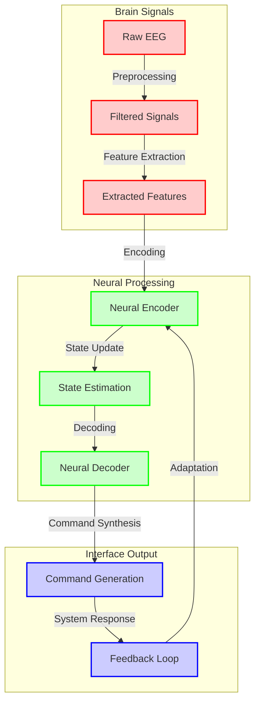
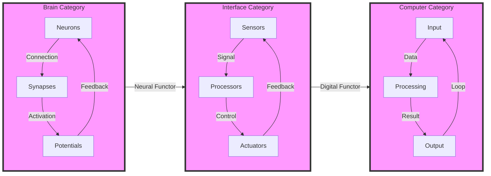
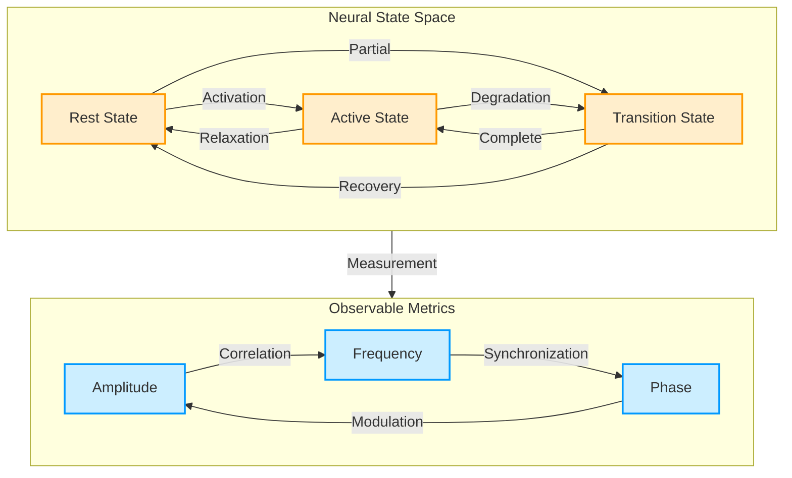

# Brain-Computer Interface Neural Wiring Diagrams

## Signal Flow Architecture

```mermaid
graph TB
    subgraph BrainSignals[Brain Signals]
        Raw[Raw EEG]
        Filtered[Filtered Signals]
        Features[Extracted Features]
        Raw -->|Preprocessing| Filtered
        Filtered -->|Feature Extraction| Features
    end

    subgraph Processing[Neural Processing]
        Encoder[Neural Encoder]
        Decoder[Neural Decoder]
        State[State Estimation]
        Features -->|Encoding| Encoder
        Encoder -->|State Update| State
        State -->|Decoding| Decoder
    end

    subgraph Output[Interface Output]
        Command[Command Generation]
        Feedback[Feedback Loop]
        Decoder -->|Command Synthesis| Command
        Command -->|System Response| Feedback
        Feedback -->|Adaptation| Encoder
    end

    classDef brainNode fill:#ffcccc,stroke:#ff0000,stroke-width:2px;
    classDef processNode fill:#ccffcc,stroke:#00ff00,stroke-width:2px;
    classDef outputNode fill:#ccccff,stroke:#0000ff,stroke-width:2px;

    class Raw,Filtered,Features brainNode;
    class Encoder,Decoder,State processNode;
    class Command,Feedback outputNode;
```

## Category Theoretical View

```mermaid
graph LR
    subgraph BrainCategory[Brain Category]
        B1[Neurons]
        B2[Synapses]
        B3[Potentials]
        B1 -->|Connection| B2
        B2 -->|Activation| B3
        B3 -->|Feedback| B1
    end

    subgraph InterfaceCategory[Interface Category]
        I1[Sensors]
        I2[Processors]
        I3[Actuators]
        I1 -->|Signal| I2
        I2 -->|Control| I3
        I3 -->|Feedback| I1
    end

    subgraph ComputerCategory[Computer Category]
        C1[Input]
        C2[Processing]
        C3[Output]
        C1 -->|Data| C2
        C2 -->|Result| C3
        C3 -->|Loop| C1
    end

    BrainCategory -->|Neural Functor| InterfaceCategory
    InterfaceCategory -->|Digital Functor| ComputerCategory

    classDef categoryNode fill:#f9f,stroke:#333,stroke-width:4px;
    class BrainCategory,InterfaceCategory,ComputerCategory categoryNode;
```

## Neural State Space

```mermaid
graph TB
    subgraph StateSpace[Neural State Space]
        S1[Rest State]
        S2[Active State]
        S3[Transition State]
        S1 -->|Activation| S2
        S2 -->|Relaxation| S1
        S1 -->|Partial| S3
        S3 -->|Complete| S2
        S2 -->|Degradation| S3
        S3 -->|Recovery| S1
    end

    subgraph Observables[Observable Metrics]
        O1[Amplitude]
        O2[Frequency]
        O3[Phase]
        O1 -->|Correlation| O2
        O2 -->|Synchronization| O3
        O3 -->|Modulation| O1
    end

    StateSpace -->|Measurement| Observables

    classDef stateNode fill:#ffeecc,stroke:#ff9900,stroke-width:2px;
    classDef obsNode fill:#cceeff,stroke:#0099ff,stroke-width:2px;

    class S1,S2,S3 stateNode;
    class O1,O2,O3 obsNode;
```