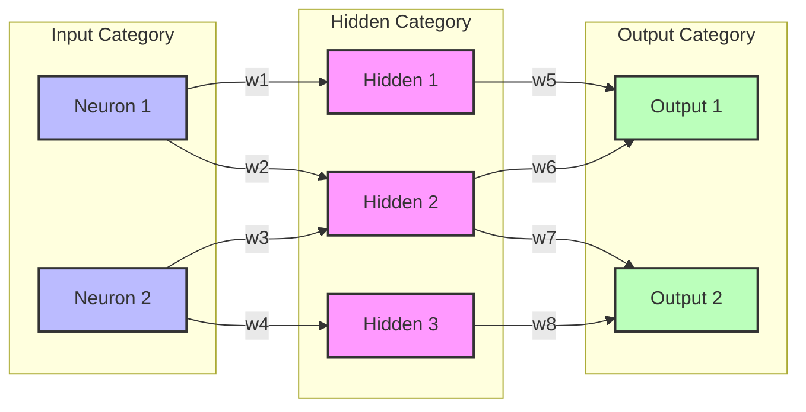
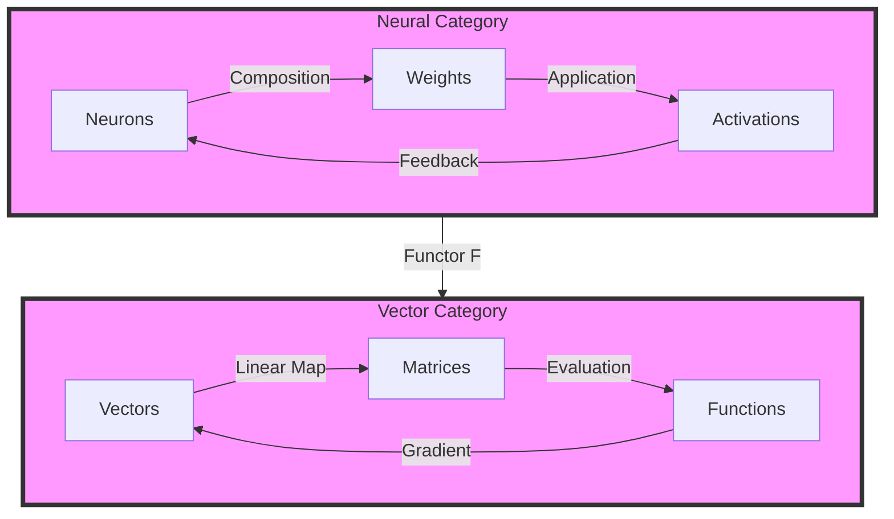
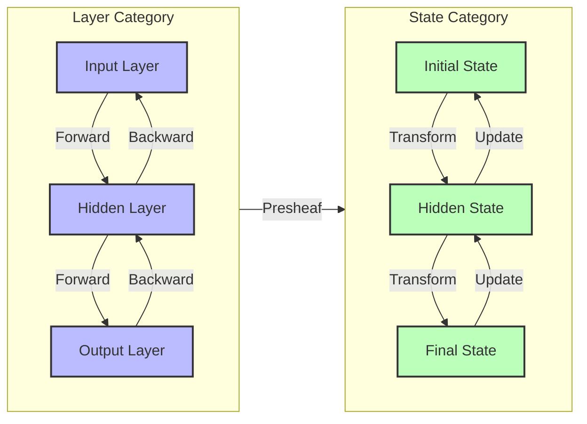

# Neural Category Theory Diagrams

## Basic Neural Morphism

```mermaid
graph LR
    subgraph Input[Input Category]
        I1[Neuron 1]
        I2[Neuron 2]
    end
    
    subgraph Hidden[Hidden Category]
        H1[Hidden 1]
        H2[Hidden 2]
        H3[Hidden 3]
    end
    
    subgraph Output[Output Category]
        O1[Output 1]
        O2[Output 2]
    end
    
    I1 -->|w1| H1
    I1 -->|w2| H2
    I2 -->|w3| H2
    I2 -->|w4| H3
    
    H1 -->|w5| O1
    H2 -->|w6| O1
    H2 -->|w7| O2
    H3 -->|w8| O2
    
    classDef default fill:#f9f,stroke:#333,stroke-width:2px;
    classDef input fill:#bbf,stroke:#333,stroke-width:2px;
    classDef output fill:#bfb,stroke:#333,stroke-width:2px;
    
    class I1,I2 input;
    class O1,O2 output;
```

## Functorial Relationships

```mermaid
graph TB
    subgraph NeuralCategory[Neural Category]
        N1[Neurons]
        N2[Weights]
        N3[Activations]
        N1 -->|Composition| N2
        N2 -->|Application| N3
        N3 -->|Feedback| N1
    end
    
    subgraph VectorCategory[Vector Category]
        V1[Vectors]
        V2[Matrices]
        V3[Functions]
        V1 -->|Linear Map| V2
        V2 -->|Evaluation| V3
        V3 -->|Gradient| V1
    end
    
    NeuralCategory -->|Functor F| VectorCategory
    
    classDef category fill:#f9f,stroke:#333,stroke-width:4px;
    class NeuralCategory,VectorCategory category;
```

## Neural Network as a Presheaf

```mermaid
graph LR
    subgraph Layers[Layer Category]
        L1[Input Layer]
        L2[Hidden Layer]
        L3[Output Layer]
        L1 -->|Forward| L2
        L2 -->|Forward| L3
        L3 -->|Backward| L2
        L2 -->|Backward| L1
    end
    
    subgraph States[State Category]
        S1[Initial State]
        S2[Hidden State]
        S3[Final State]
        S1 -->|Transform| S2
        S2 -->|Transform| S3
        S3 -->|Update| S2
        S2 -->|Update| S1
    end
    
    Layers -->|Presheaf| States
    
    classDef layerNode fill:#bbf,stroke:#333,stroke-width:2px;
    classDef stateNode fill:#bfb,stroke:#333,stroke-width:2px;
    
    class L1,L2,L3 layerNode;
    class S1,S2,S3 stateNode;
```
