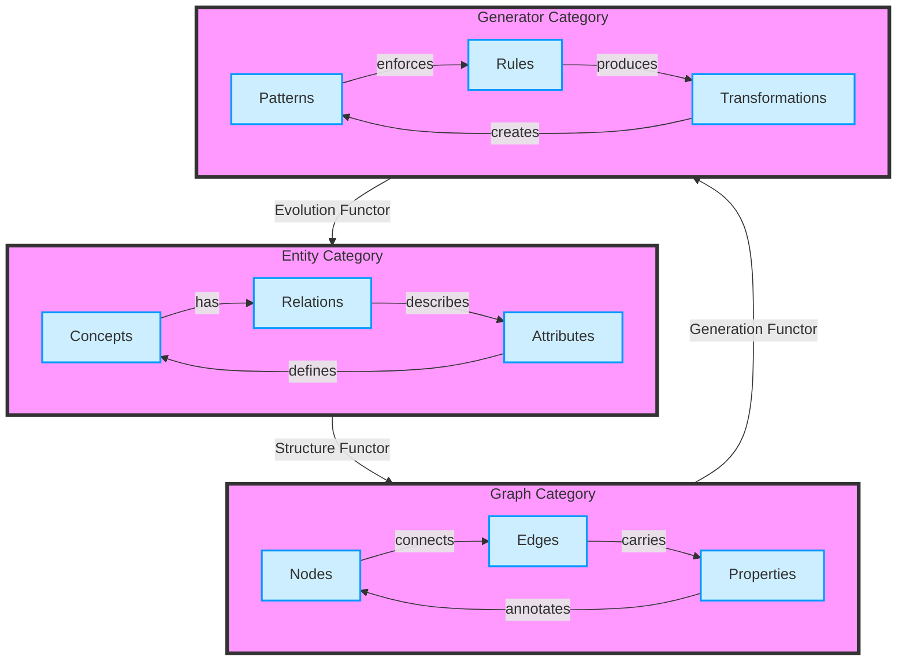
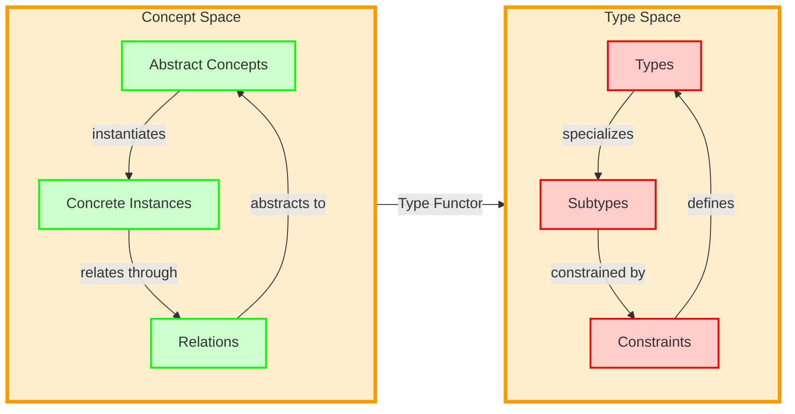
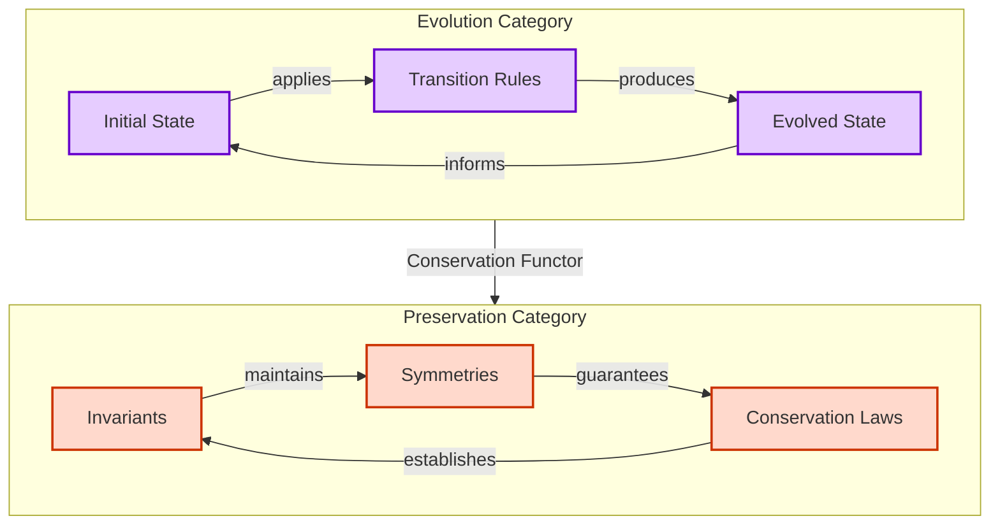

# Ontological Category Theory Diagrams

## E(GG) Ontology Machine

```mermaid
graph TB
    subgraph EntityCategory[Entity Category]
        E1[Concepts]
        E2[Relations]
        E3[Attributes]
        E1 -->|has| E2
        E2 -->|describes| E3
        E3 -->|defines| E1
    end

    subgraph GraphCategory[Graph Category]
        G1[Nodes]
        G2[Edges]
        G3[Properties]
        G1 -->|connects| G2
        G2 -->|carries| G3
        G3 -->|annotates| G1
    end

    subgraph GeneratorCategory[Generator Category]
        GG1[Patterns]
        GG2[Rules]
        GG3[Transformations]
        GG1 -->|enforces| GG2
        GG2 -->|produces| GG3
        GG3 -->|creates| GG1
    end

    EntityCategory -->|Structure Functor| GraphCategory
    GraphCategory -->|Generation Functor| GeneratorCategory
    GeneratorCategory -->|Evolution Functor| EntityCategory

    classDef categoryNode fill:#f9f,stroke:#333,stroke-width:4px;
    classDef elementNode fill:#cceeff,stroke:#0099ff,stroke-width:2px;

    class EntityCategory,GraphCategory,GeneratorCategory categoryNode;
    class E1,E2,E3,G1,G2,G3,GG1,GG2,GG3 elementNode;
```

## Ontological Presheaf Structure

```mermaid
graph LR
    subgraph ConceptSpace[Concept Space]
        C1[Abstract Concepts]
        C2[Concrete Instances]
        C3[Relations]
        C1 -->|instantiates| C2
        C2 -->|relates through| C3
        C3 -->|abstracts to| C1
    end

    subgraph TypeSpace[Type Space]
        T1[Types]
        T2[Subtypes]
        T3[Constraints]
        T1 -->|specializes| T2
        T2 -->|constrained by| T3
        T3 -->|defines| T1
    end

    ConceptSpace -->|Type Functor| TypeSpace

    classDef spaceNode fill:#ffeecc,stroke:#ff9900,stroke-width:4px;
    classDef conceptNode fill:#ccffcc,stroke:#00ff00,stroke-width:2px;
    classDef typeNode fill:#ffcccc,stroke:#ff0000,stroke-width:2px;

    class ConceptSpace,TypeSpace spaceNode;
    class C1,C2,C3 conceptNode;
    class T1,T2,T3 typeNode;
```

## Categorical Evolution

```mermaid
graph TB
    subgraph Evolution[Evolution Category]
        EV1[Initial State]
        EV2[Transition Rules]
        EV3[Evolved State]
        EV1 -->|applies| EV2
        EV2 -->|produces| EV3
        EV3 -->|informs| EV1
    end

    subgraph Preservation[Preservation Category]
        P1[Invariants]
        P2[Symmetries]
        P3[Conservation Laws]
        P1 -->|maintains| P2
        P2 -->|guarantees| P3
        P3 -->|establishes| P1
    end

    Evolution -->|Conservation Functor| Preservation

    classDef evolutionNode fill:#e6ccff,stroke:#6600cc,stroke-width:2px;
    classDef preservationNode fill:#ffd9cc,stroke:#cc3300,stroke-width:2px;

    class EV1,EV2,EV3 evolutionNode;
    class P1,P2,P3 preservationNode;
```